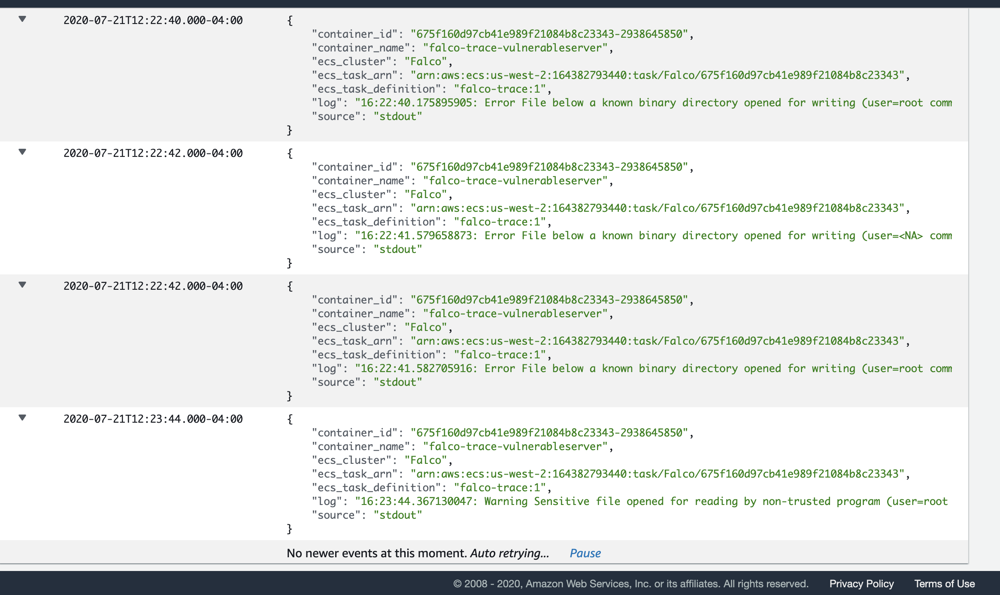

# falco-fargate-firelens

1. Change account ID, and role in the task defintion
2. Create task defintion using ```taskdef.json``` Check the firelens [docs](https://docs.aws.amazon.com/AmazonECS/latest/developerguide/using_firelens.html) for help on IAM roles 

3. Create service using Fargate version 1.4

4. Test it using Nmap (Ncat)
```bash
brew install namp
```
```bash
ncat -nv <PUBLIC_IP> <443>

#ncat -nv 34.218.230.147 443
# Ncat: Version 7.80 ( https://nmap.org/ncat )
# Ncat: Connected to 34.218.230.147:443.

touch /usr/bin/1
touch /usr/bin/2
touch /usr/bin/3
ls /usr/bin | head -3
1
2
3

cat /etc/shadow > /dev/null 2>&1
```
5. Check firelens logs from Cloudwatch at ```falco/alerts```

6. Check the container logs from falco alerting of bad activity.



To see more examples check out Kris Nova from Sysdig [Examples](https://github.com/kris-nova/falco-trace#aws-ecsfargate)
